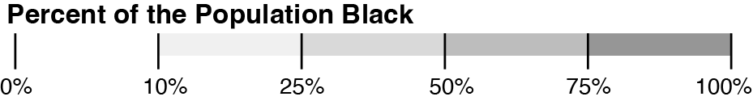

Import Block file with command `name=blocks`

Import Block csv with commands `name=blocks_csv string-fields=GEOCODE`

Join the data

```
-simplify target=blocks 10%
-join target=blocks source=blocks_csv keys=GEOID20,GEOCODE`
```

This creates the Black percentage in the blocks layer
```
-each target=blocks 'blackper=BLACK/TOTAL'
-classify target=blocks field=blackper save-as=fill key-name="legend_Black" key-style="simple" key-tile-height=10 key-width=320 key-font-size=10 nice colors='#ffffff,#f0f0f0,#d9d9d9,#bdbdbd,#969696' breaks=0.1,0.25,0.5,0.75 null-value="#fff"
```

Import a cartographic shapefile to clip shoreline. Use command `name=clip`
```
-filter target=clip STATEFP==01
-style target=clip fill=none stroke=#000 opacity=1 stroke-opacity=1
```

Load USA_MajorCities.geojson with command `name=cities`
```
-filter target=cities ST=='AL'
-filter target=cities POP_CLASS>=7
-filter target=cities POP_CLASS>=7 + name=cities-labels
-style target=cities-labels label-text=NAME
-style target=cities r=2
```

Run this to create a layer for counties
```
-dissolve target=blocks COUNTYFP20 + name=county
-style target=county fill=none stroke-opacity=0.5 stroke=#fff stroke-width=0.5
```

Add the Congressional District Shapefile with command `name=cd`
```
-style target=cd stroke-width=2
```

Project all layers
```
-proj target=* '+proj=tmerc +lat_0=30 +lon_0=-87.5 +k=0.9999333333333333 +x_0=600000.0000000001 +y_0=0 +ellps=GRS80 +datum=NAD83 +to_meter=0.3048006096012192 +no_defs'
```



