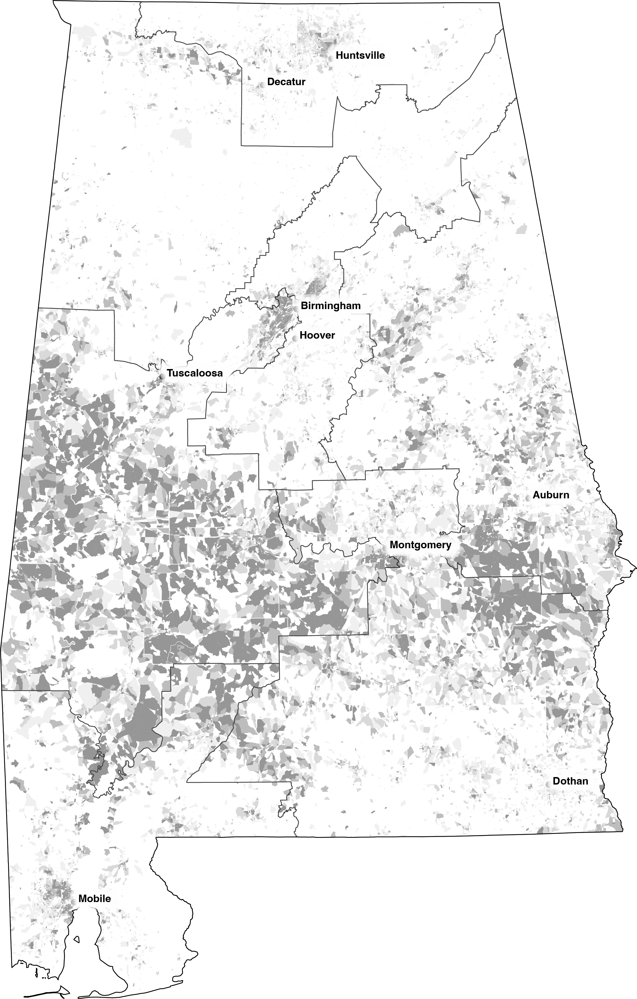

Import Block and Tract file with command `name=blocks`
```
mapshaper \
-i '/Users/cervas/My Drive/GitHub/Data Files/Census/AL2020.pl/GIS/blocks/blocks.json' name=blocks \
-i '/Users/cervas/My Drive/GitHub/Data Files/Census/AL2020.pl/GIS/tracts/tl_2020_01_tract20.shp' name=tracts \
-simplify target=blocks 0.01 \
-simplify target=tracts 0.01 \
```

This creates the Black percentage in the blocks layer
```
-each target=blocks 'blackper=BLACK/TOTAL' \
-each target=tracts 'blackper=BLACK/TOTAL' \
-classify target=blocks field=blackper save-as=fill key-name="legend_Black" key-style="simple" key-tile-height=10 key-width=320 key-font-size=10 nice colors='#ffffff,#f0f0f0,#d9d9d9,#bdbdbd,#969696' breaks=0.1,0.25,0.5,0.75 null-value="#fff" \
-classify target=tracts field=blackper save-as=fill key-name="legend_Black" key-style="simple" key-tile-height=10 key-width=320 key-font-size=10 nice colors='#ffffff,#f0f0f0,#d9d9d9,#bdbdbd,#969696' breaks=0.1,0.25,0.5,0.75 null-value="#fff" \
```

Import a cartographic shapefile to us-cart shoreline. Use command `name=us-cart`
```
-i '/Users/cervas/My Drive/GitHub/createMaps/AL/us-cart.json' name=us-cart \
-filter target=us-cart STATEFP==01 \
-style target=us-cart fill=none stroke=#000 opacity=1 stroke-opacity=1 \
```

Add the Congressional District Shapefile with command `name=cd`
```
-i '/Users/cervas/My Drive/GitHub/createMaps/AL/plans/AL 2022 Congressional.geojson' name=cd2021 \
-i '/Users/cervas/My Drive/GitHub/createMaps/AL/plans/Livingston_Congressional_Plan_3.json' name=livingston3 \
-style target=cd2021 stroke-width=1 fill=none stroke-opacity=1 stroke=#000 \
-style target=livingston3 stroke-width=1 fill=none stroke-opacity=1 stroke=#000 \
```

Run this to create a layer for counties
```
-dissolve target=tracts COUNTYFP20 + name=county \
-style target=county fill=none stroke-opacity=1 stroke=#fff stroke-width=1 \
```

Add `cities` layer, which is preprocessed (see below)
```
-i '/Users/cervas/My Drive/GitHub/createMaps/AL/cities.json' name=cities \
```

Project all layers
```
-proj target=blocks,tracts,us-cart,county,cd2021,livingston3 '+proj=tmerc +lat_0=30 +lon_0=-87.5 +k=0.9999333333333333 +x_0=600000.0000000001 +y_0=0 +ellps=GRS80 +datum=NAD83 +to_meter=0.3048006096012192 +no_defs' \
```

us-cart layers to cartographic layer
```
-clip target=blocks us-cart \
-clip target=tracts us-cart \
-clip target=county us-cart \
-clip target=cd2021 us-cart \
-clip target=livingston3 us-cart \
```

Output as .svg file
```
-o target=blocks,county,cd2021,cities,us-cart '/Users/cervas/My Drive/GitHub/createMaps/AL/images/cd2021.svg' format=svg \
-o target=tracts,county,cd2021,cities,us-cart '/Users/cervas/My Drive/GitHub/createMaps/AL/images/livingston3.svg' format=svg \
```





Load USA_MajorCities.geojson with command `name=cities`
```
-filter target=cities ST=='AL'
-filter target=cities POP_CLASS>=7
-filter target=cities POP_CLASS>=7 + name=cities-labels
-filter-fields target=* NAME
-style target=cities-labels label-text=NAME text-anchor=start font-size=13px font-weight=800 line-height=16px font-family=helvetica class="g-text-shadow p"
-each target=cities-labels dx=5
-each target=cities-labels dy=0
-style target=cities r=4
-each target=cities type='point'
-each target=cities-labels type='text-label'
-merge-layers target=* force
-o target=* format=geojson
```

Arrange labels and merge
```
-merge-layers target=* force
```
