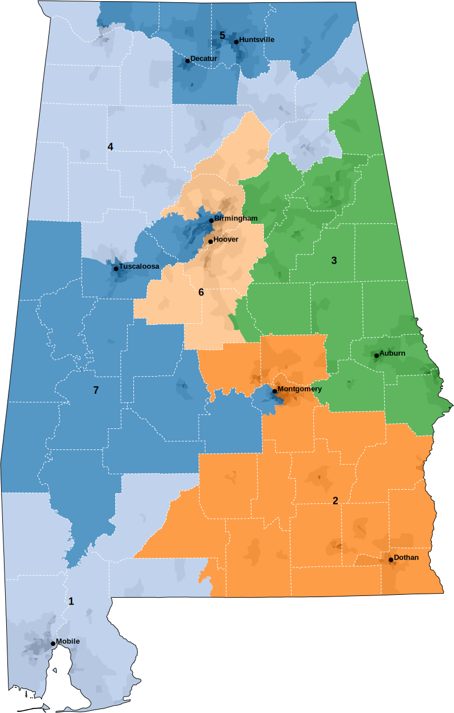

Import Block and Tract file with command `name=blocks`
```
mapshaper \
-i '/Users/cervas/My Drive/GitHub/Data Files/Census/AL2020.pl/GIS/block/blocks20.shp' name=blocks \
-i '/Users/cervas/My Drive/GitHub/Data Files/Census/AL2020.pl/GIS/tract/tracts20.shp' name=tracts \
-simplify target=blocks 0.01 \
-simplify target=tracts 0.01 \
```

Run this to create a layer for counties
```
-dissolve target=tracts COUNTYF + name=county \
-innerlines \
-style target=county fill=none stroke=#fff stroke-width=1 stroke-dasharray="0 3 0" \
```

This creates the Black percentage in the blocks/tracts layer
```
-each target=blocks 'blackper=BLACK/TOTAL*100' \
-each target=tracts 'blackper=BLACK/TOTAL*100' \
-each target=blocks 'density = TOTAL / (ALAND/2589988)' \
-each target=tracts 'density = TOTAL / (ALAND/2589988)' \
-filter target=blocks STATE==01 + name=blocks_b \
-filter target=tracts STATE==01 + name=tracts_b \
-classify target=blocks field=density save-as=fill nice colors=greys classes=5 \
-classify target=tracts field=density save-as=fill nice colors=greys classes=5 \
-classify target=blocks_b field=blackper save-as=fill key-name="legend_Black" key-style="simple" key-tile-height=10 key-width=320 key-font-size=10 key-last-suffix='%' nice colors='#ffffff,#f0f0f0,#d9d9d9,#bdbdbd,#969696' breaks=10,25,50,75 null-value="#fff" \
-classify target=tracts_b field=blackper save-as=fill nice colors='#ffffff,#f0f0f0,#d9d9d9,#bdbdbd,#969696' breaks=10,25,50,75 null-value="#fff" \
-dissolve target=blocks field=fill \
-dissolve target=tracts field=fill \
-dissolve target=blocks_b field=fill \
-dissolve target=tracts_b field=fill \
```

Import a cartographic shapefile to us-cart shoreline. Use command `name=us-cart`
```
-i '/Users/cervas/My Drive/GitHub/createMaps/us-cart.json' name=us-cart \
-filter target=us-cart STATEFP==01 \
-style target=us-cart fill=none stroke=#000 opacity=1 stroke-opacity=1 \
```

Add the Congressional District Shapefile with command `name=cd`
```
-i '/Users/cervas/My Drive/GitHub/createMaps/AL/plans/AL 2021 Congressional.geojson' name=cd2021 \
-i '/Users/cervas/My Drive/GitHub/createMaps/AL/plans/AL 2023 Congressional.geojson' name=cd2023 \
-i '/Users/cervas/My Drive/GitHub/createMaps/AL/plans/AL 2021 Congressional - Minimum Change.geojson' name=cd2021min \
-i '/Users/cervas/My Drive/GitHub/createMaps/AL/plans/AL 2023 Congressional - Minimum Change.geojson' name=cd2023min \
-style target=cd2021 stroke-width=1 fill=none stroke-opacity=1 stroke=#000 \
-style target=cd2023 stroke-width=1 fill=none stroke-opacity=1 stroke=#000 \
-style target=cd2021min stroke-width=1 fill=none stroke-opacity=1 stroke=#000 \
-style target=cd2023min stroke-width=1 fill=none stroke-opacity=1 stroke=#000 \
```

Add `cities` layer, which is preprocessed (see below)
```
-i '/Users/cervas/My Drive/GitHub/createMaps/AL/cities.json' name=cities \
```

us-cart layers to cartographic layer
```
-clip target=blocks us-cart \
-clip target=tracts us-cart \
-clip target=blocks_b us-cart \
-clip target=tracts_b us-cart \
-clip target=county us-cart \
-clip target=cd2021 us-cart \
-clip target=cd2023 us-cart \
-clip target=cd2021min us-cart \
-clip target=cd2023min us-cart \
```

Project all layers
```
-proj target=blocks,blocks_b,tracts,tracts_b,us-cart,county,cities,cd2021,cd2023,cd2021min,cd2023min '+proj=tmerc +lat_0=30 +lon_0=-87.5 +k=0.9999333333333333 +x_0=600000.0000000001 +y_0=0 +ellps=GRS80 +datum=NAD83 +to_meter=0.3048006096012192 +no_defs' \
```

Label Districts
```
-each target=cd2021 'cx=this.innerX, cy=this.innerY' \
-each target=cd2023 'cx=this.innerX, cy=this.innerY' \
-each target=cd2021min 'cx=this.innerX, cy=this.innerY' \
-each target=cd2023min 'cx=this.innerX, cy=this.innerY' \
-points target=cd2021 x=cx y=cy + name=cd2021-labels \
-points target=cd2023 x=cx y=cy + name=cd2023-labels \
-points target=cd2021min x=cx y=cy + name=cd2021min-labels \
-points target=cd2023min x=cx y=cy + name=cd2023min-labels \
-style target=cd2021-labels label-text=NAME text-anchor=middle fill=#000 stroke=none opacity=1 font-size=18px font-weight=800 line-height=20px font-family=arial class="g-text-shadow p" \
-style target=cd2023-labels label-text=NAME text-anchor=middle fill=#000 stroke=none opacity=1 font-size=18px font-weight=800 line-height=20px font-family=arial class="g-text-shadow p" \
-style target=cd2021min-labels label-text=NAME text-anchor=middle fill=#000 stroke=none opacity=1 font-size=18px font-weight=800 line-height=20px font-family=arial class="g-text-shadow p" \
-style target=cd2023min-labels label-text=NAME text-anchor=middle fill=#000 stroke=none opacity=1 font-size=18px font-weight=800 line-height=20px font-family=arial class="g-text-shadow p" \
```

Output Population Density as .svg files
```
-o target=blocks,county,cd2021,cities,us-cart '/Users/cervas/My Drive/GitHub/createMaps/AL/images/cd2021_blocks.svg' format=svg \
-o target=blocks,county,cd2023,cities,us-cart '/Users/cervas/My Drive/GitHub/createMaps/AL/images/cd2023_blocks.svg' format=svg \
-o target=blocks,county,cd2021min,cities,us-cart '/Users/cervas/My Drive/GitHub/createMaps/AL/images/cd2021min_blocks.svg' format=svg \
-o target=blocks,county,cd2023min,cities,us-cart '/Users/cervas/My Drive/GitHub/createMaps/AL/images/cd2023min_blocks.svg' format=svg \
-o target=tracts,county,cd2021,cities,us-cart '/Users/cervas/My Drive/GitHub/createMaps/AL/images/cd2021_tracts.svg' format=svg \
-o target=tracts,county,cd2023,cities,us-cart '/Users/cervas/My Drive/GitHub/createMaps/AL/images/cd2023_tracts.svg' format=svg \
-o target=tracts,county,cd2021min,cities,us-cart '/Users/cervas/My Drive/GitHub/createMaps/AL/images/cd2021min_tracts.svg' format=svg \
-o target=tracts,county,cd2023min,cities,us-cart '/Users/cervas/My Drive/GitHub/createMaps/AL/images/cd2023min_tracts.svg' format=svg \
```

Output Racial compostion as .svg files
```
-o target=blocks_b,county,cd2021,cities,us-cart '/Users/cervas/My Drive/GitHub/createMaps/AL/images/cd2021-black-blocks.svg' format=svg \
-o target=blocks_b,county,cd2023,cities,us-cart '/Users/cervas/My Drive/GitHub/createMaps/AL/images/cd2023-black-blocks.svg' format=svg \
-o target=blocks_b,county,cd2021min,cities,us-cart '/Users/cervas/My Drive/GitHub/createMaps/AL/images/cd2021min-black-blocks.svg' format=svg \
-o target=blocks_b,county,cd2023min,cities,us-cart '/Users/cervas/My Drive/GitHub/createMaps/AL/images/cd2023min-black-blocks.svg' format=svg \
-o target=tracts_b,county,cd2021,cities,us-cart '/Users/cervas/My Drive/GitHub/createMaps/AL/images/cd2021-black-tracts.svg' format=svg \
-o target=tracts_b,county,cd2023,cities,us-cart '/Users/cervas/My Drive/GitHub/createMaps/AL/images/cd2023-black-tracts.svg' format=svg \
-o target=tracts_b,county,cd2021min,cities,us-cart '/Users/cervas/My Drive/GitHub/createMaps/AL/images/cd2021min-black-tracts.svg' format=svg \
-o target=tracts_b,county,cd2023min,cities,us-cart '/Users/cervas/My Drive/GitHub/createMaps/AL/images/cd2023min-black-tracts.svg' format=svg \
```

Output District Map as .svg files
```
 -classify target=cd2021 save-as=fill colors=color non-adjacent \
 -classify target=cd2023 save-as=fill colors=color non-adjacent \
 -classify target=cd2021min save-as=fill colors=color non-adjacent \
 -classify target=cd2023min save-as=fill colors=color non-adjacent \
 -style target=cd2021 opacity=0.75 stroke=none \
 -style target=cd2023 opacity=0.75 stroke=none \
 -style target=cd2021min opacity=0.75 stroke=none \
 -style target=cd2023min opacity=0.75 stroke=none \
 -o target=tracts,cd2021,county,cities,us-cart,cd2021-labels '/Users/cervas/My Drive/GitHub/createMaps/AL/images/cd2021.svg' \
 -o target=tracts,cd2023,county,cities,us-cart,cd2023-labels '/Users/cervas/My Drive/GitHub/createMaps/AL/images/cd2023.svg' \
 -o target=tracts,cd2021min,county,cities,us-cart,cd2021min-labels '/Users/cervas/My Drive/GitHub/createMaps/AL/images/cd2021min.svg' \
 -o target=tracts,cd2023min,county,cities,us-cart,cd2023min-labels '/Users/cervas/My Drive/GitHub/createMaps/AL/images/cd2023min.svg'
 
```

# 2022 Alabama Congressional Map
Map nullified in Allen v. Milligan



Load USA_MajorCities.geojson with command `name=cities`
```
mapshaper -i '/Users/cervas/My Drive/GitHub/createMaps/AL/USA_Major_Cities.geojson' name=cities \
-filter target=cities "ST=='AL'" \
-filter target=cities "POP_CLASS>=7" \
-filter target=cities "POP_CLASS>=7" + name=cities-labels \
-filter-fields target=cities,cities-labels NAME \
-style target=cities-labels label-text=NAME text-anchor=start font-size=13px font-weight=800 line-height=16px font-family=arial class="g-text-shadow p" \
-each target=cities-labels dx=5 \
-each target=cities-labels dy=0 \
-style target=cities r=4 \
-each target=cities "type='point'" \
-each target=cities-labels "type='text-label'" \
-merge-layers target=cities,cities-labels force \
-o target=cities,cities-labels '/Users/cervas/My Drive/GitHub/createMaps/AL/cities.json' format=geojson
```

Arrange labels and merge
```
-merge-layers target=* force
```
