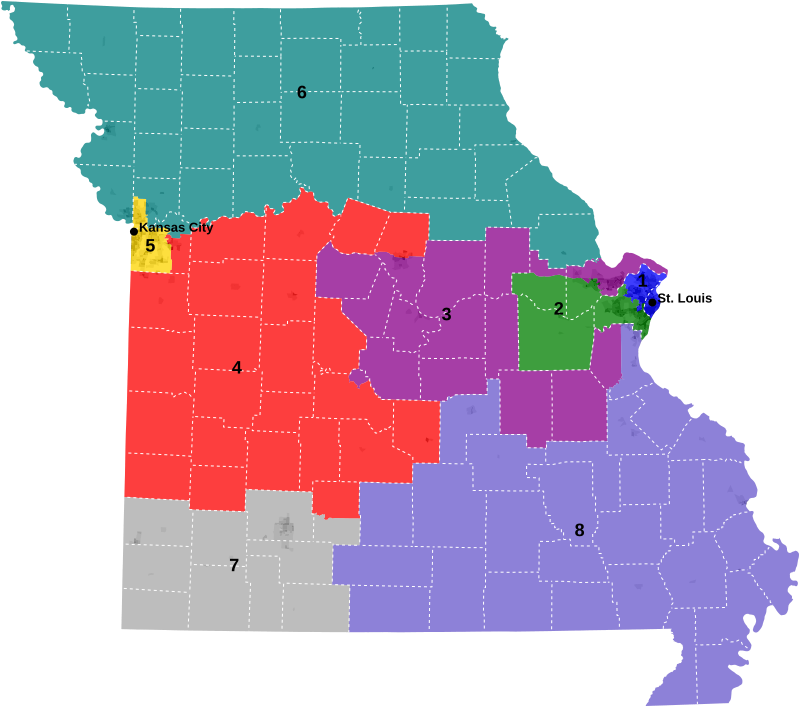
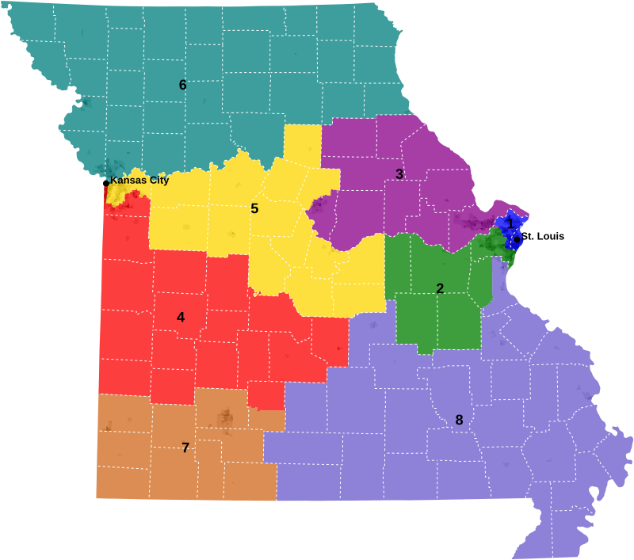

# 2022 Missouri Congressional Map


# 2026 Missouri Congressional Map



Import Block and Tract file with command `name=blocks`
```
cd '/Users/cervas/Library/CloudStorage/GoogleDrive-jcervas@andrew.cmu.edu/My Drive/GitHub/createMaps/MO'

mapshaper \
-i 'GIS/tl_2020_29_tabblock20.json' name=blocks \
-i 'GIS/tl_2020_29_tract20.json' name=tracts \
-i 'data/pop.csv' string-fields=GEOID \
-i 'data/pop_tracts.csv' string-fields=GEOID \
-join target=blocks source=pop keys=GEOID20,GEOID \
-join target=tracts source=pop_tracts keys=GEOID20,GEOID \
-simplify target=blocks 0.01 \
-simplify target=tracts 0.01 \
```

Run this to create a layer for counties
```
-dissolve target=tracts COUNTYFP20 + name=counties \
-innerlines \
-style target=counties fill=none stroke=#fff stroke-width=1 stroke-dasharray="0 3 0" \
```

Add Density Variable to data
```
-each target=blocks 'density = TOTAL / (ALAND20/2589988)' \
-each target=tracts 'density = TOTAL / (ALAND20/2589988)' \
-classify target=blocks field=density save-as=fill nice colors=greys classes=5 \
-classify target=tracts field=density save-as=fill nice colors=greys classes=5 \
-dissolve target=blocks field=fill \
-dissolve target=tracts field=fill \
```

Add the Congressional District Shapefile with command `name=cd`
```
-i 'GIS/mo-2022-congress.geojson' name=cd2022 \
-i 'GIS/mo-2026-congress.geojson' name=cd2026 \
-style target=cd2022 stroke-width=1 fill=none stroke-opacity=1 stroke=#000 \
-style target=cd2026 stroke-width=1 fill=none stroke-opacity=1 stroke=#000 \
```


Load USA_MajorCities.geojson with command `name=cities`
```
-i '/Users/cervas/Library/CloudStorage/GoogleDrive-jcervas@andrew.cmu.edu/My Drive/GitHub/createMaps/USA_Major_Cities.geojson' name=cities \
-filter target=cities "ST=='MO'" \
-filter target=cities "POPULATION>=200000" \
-filter target=cities "POPULATION>=200000" + name=cities-labels \
-filter-fields target=cities,cities-labels NAME \
-style target=cities-labels label-text=NAME text-anchor=start font-size=13px font-weight=800 line-height=16px font-family=arial class="g-text-shadow p" \
-each target=cities-labels dx=5 \
-each target=cities-labels dy=0 \
-style target=cities r=4 \
-each target=cities "type='point'" \
-each target=cities-labels "type='text-label'" \
-merge-layers target=cities,cities-labels force \
-o target=cities 'cities.json' format=geojson \
```

Project all layers
```
-proj target=blocks,tracts,counties,cities,cd2022,cd2026 EPSG:2816 \
```

Label Districts
```
-each target=cd2022 'cx=this.innerX, cy=this.innerY' \
-points target=cd2022 x=cx y=cy + name=cd2022-labels \
-style target=cd2022-labels label-text=NAME text-anchor=middle fill=#000 stroke=none opacity=1 font-size=18px font-weight=800 line-height=20px font-family=arial class="g-text-shadow p" \
```

```
-each target=cd2026 'cx=this.innerX, cy=this.innerY' \
-points target=cd2026 x=cx y=cy + name=cd2026-labels \
-style target=cd2026-labels label-text=NAME text-anchor=middle fill=#000 stroke=none opacity=1 font-size=18px font-weight=800 line-height=20px font-family=arial class="g-text-shadow p" \
```


Output Population Density as .svg files
```
-o target=cities,counties,blocks 'images/blocks.svg' format=svg \
-o target=cities,counties,tracts 'images/tracts.svg' format=svg \
```


```
-style target=cd2022 fill=color \
-style target=cd2022 opacity=0.75 stroke=none \
-o target=tracts,cd2022,counties,cities,cd2022-labels 'images/cd2022.svg' \
```

```
-style target=cd2026 fill=color \
-style target=cd2026 opacity=0.75 stroke=none \
-o target=tracts,cd2026,counties,cities,cd2026-labels 'images/cd2026.svg'
```

```shell
find . -type f -name "*.svg" | while read -r f; do
  sed -i '' '/<\/svg>/i\
<style media="screen,print">\
.g-Shadow p { text-shadow: 1px 1px 0px rgba(254, 254, 254, .15); }\
.g-text-shadow { text-shadow: 1px 1px 1px rgba(254,254,254,1), -1px 1px 1px rgba(254,254,254,1), 1px -1px 1px rgba(254,254,254,1), -1px -1px 1px rgba(254,254,254,1); }\
</style>
' "$f"
done
```


Arrange labels and merge
```
-merge-layers target=* force
```

## Add css to .svg
```{css}
<style media="screen,print">
/* Custom CSS */
.g-Shadow p {
    text-shadow: 1px 1px 0px rgba(254, 254, 254, .15);
}

.g-text-shadow {
    text-shadow: 1px 1px 1px rgba(254, 254, 254, 1), -1px 1px 1px rgba(254, 254, 254, 1), 1px -1px 1px rgba(254, 254, 254, 1), -1px -1px 1px rgba(254, 254, 254, 1);
}
</style>
```
