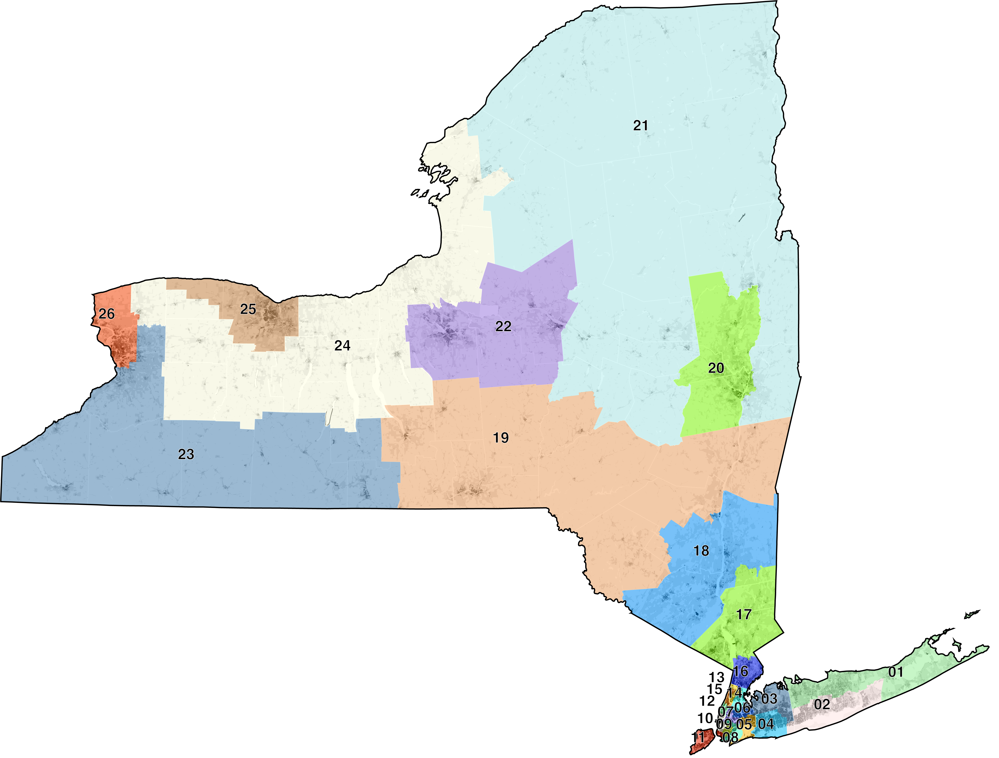

NY

```
mapshaper
-i us-cartographic.geojson name=clip
-i ny-cd-2022.geojson name=ny-cd
-i tracts.json name=pop
-dissolve target=pop COUNTYF + name=county
-style target=county fill=none stroke-opacity=0.5 stroke=#fff stroke-width=0.5
-dots target=pop fields=TOTAL save-as=fill r=0.1 per-dot=100 copy-fields=TOTAL
-proj target=* '+proj=tmerc +lat_0=40 +lon_0=-76.58333333333333 +k=0.999938 +x_0=250000 +y_0=0 +ellps=GRS80 +datum=NAD83 +to_meter=0.3048006096012192 +no_defs'
-filter target=clip STATEFP==36
-style target=clip fill=none stroke=#000 opacity=1 stroke-opacity=1
-clip target=ny-cd source=clip
-clip target=ny-cd source=clip
-each target=ny-cd "cx=$.innerX, cy=$.innerY"
-points target=ny-cd x=cx y=cy + name=district-labels
-style target=district-labels label-text=id
-style target=pop fill=none stroke=#fff stroke-width=0.5
-each 'density = TOTAL / (ALAND/2589988)' target=pop
-each 'sqrtdensity = Math.sqrt(density)' target=pop
-classify target=pop field=sqrtdensity save-as=fill breaks=10,20,40,80,160,320 colors=Greys classes=9 null-value="#fff"
-style target=ny-cd fill=color stroke=none
```

