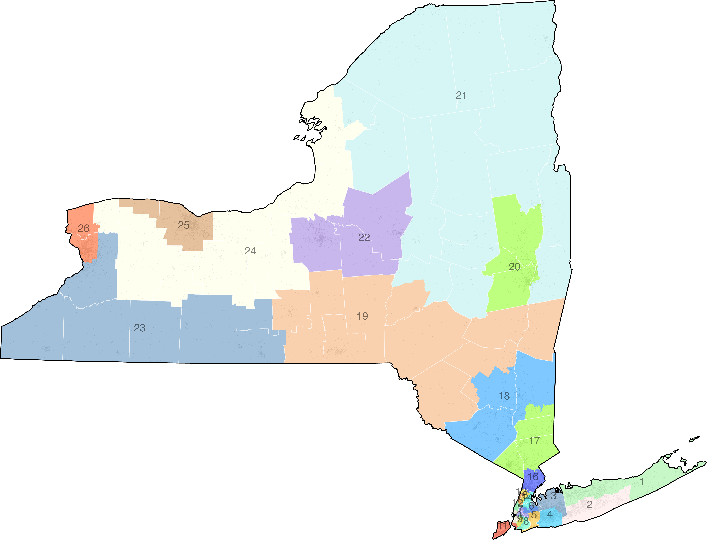

NY

```
cd '/Users/cervas/My Drive/GitHub/createMaps/NY/images/legends'
mapshaper \
-i '/Users/cervas/My Drive/GitHub/createMaps/NY/us-cartographic.json' name=ST \
-i '/Users/cervas/My Drive/GitHub/createMaps/NY/ny-cd-2022.geojson' name=ny-cd \
-i '/Users/cervas/My Drive/GitHub/createMaps/NY/tracts20.json' name=pop \
-i '/Users/cervas/My Drive/GitHub/createMaps/NY/ny-senate-2022.geojson' name=ny-senate \
-i '/Users/cervas/My Drive/GitHub/createMaps/us-urban.json' name=urban \
-dissolve target=pop COUNTYF + name=county \
-style target=county fill=none stroke-opacity=0.5 stroke=#fff stroke-width=0.5 \
-each target=pop 'density = TOTAL / (ALAND/2589988)' \
-classify target=pop field=density save-as=fill nice colors=greys classes=5 key-name="legend_densityNY_tracts" key-style="simple" key-tile-height=10 key-width=320 key-font-size=10 key-last-suffix="" \
-dots target=pop fields=TOTAL save-as=fill r=0.1 per-dot=100 copy-fields=TOTAL + name=pop-dots \
-style target=pop-dots fill=#ccc \
-proj target=urban,pop,pop-dots,county,ST,ny-cd,ny-senate '+proj=tmerc +lat_0=40 +lon_0=-76.58333333333333 +k=0.999938 +x_0=250000 +y_0=0 +ellps=GRS80 +datum=NAD83 +to_meter=0.3048006096012192 +no_defs' \
-filter target=ST STATEFP==36 \
-style target=ST fill=none stroke=#000 opacity=1 stroke-opacity=1 \
-clip target=ny-cd source=ST \
-clip target=ny-senate source=ST \
-clip target=county source=ST \
-clip target=pop source=ST \
-clip target=urban source=ST \
-each target=ny-cd "cx=$.innerX, cy=$.innerY" \
-points target=ny-cd x=cx y=cy + name=district-labels \
-style target=district-labels label-text=id  text-anchor=start font-size=13px font-weight=800 line-height=16px font-family=arial class="g-text-shadow p" \
-style target=ny-cd fill=color stroke=none \
-each target=ny-senate "cx=$.innerX, cy=$.innerY" \
-points target=ny-senate x=cx y=cy + name=senate-district-labels \
-style target=senate-district-labels label-text=id text-anchor=start font-size=13px font-weight=800 line-height=16px font-family=arial class="g-text-shadow p" \
-style target=ny-senate fill=color stroke=none \
-o target=urban,ny-cd,county,district-labels,ST '/Users/cervas/My Drive/GitHub/createMaps/NY/images/ny-cd.svg' \
-o target=urban,ny-senate,county,ST '/Users/cervas/My Drive/GitHub/createMaps/NY/images/ny-senate.svg'
```


