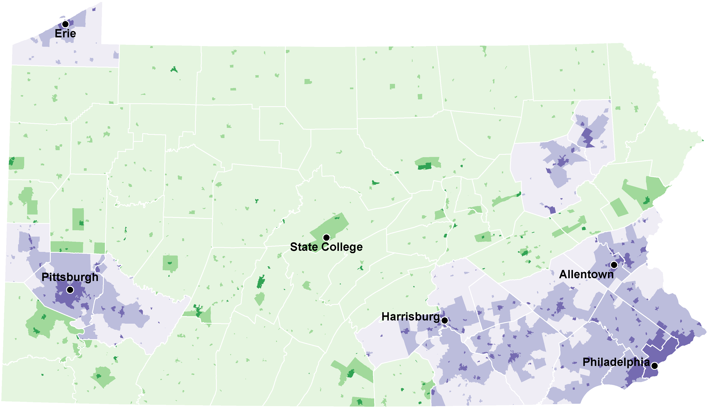
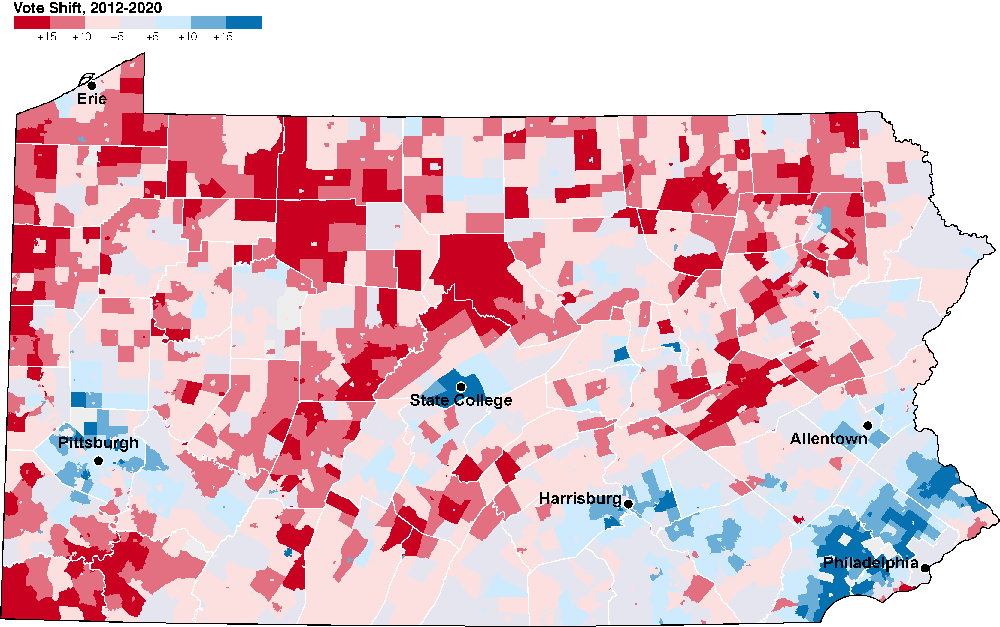

# Seth's Classification Scheme

`
cd "/Users/cervas/My Drive/GitHub/createMaps/PA/seth"
mapshaper \
-i '/Users/cervas/My Drive/GitHub/createMaps/PA/seth/tl_2020_42_cousub20.json' name=muni \
-proj EPSG:3652 \
-i '/Users/cervas/My Drive/GitHub/createMaps/PA/seth/all_merged.csv' string-fields=COUSUB20 name=all_merged \
-join target=muni source=all_merged keys=GEOID20,COUSUB20 \
-filter target=muni "countyclass=='urban'" + name=urban \
-filter target=muni "countyclass=='rural'" + name=rural \
-classify target=urban field=municipalclass colors=Purples key-name="legend_urbancounty" key-style="simple" key-tile-height=10 key-width=320 key-font-size=10 \
-classify target=rural field=municipalclass colors=Greens key-name="legend_ruralcounty" key-style="simple" key-tile-height=10 key-width=320 key-font-size=10 \
-o target=urban,rural '/Users/cervas/My Drive/GitHub/createMaps/PA/seth/classification-map.svg'
`

# Election Swing, 2012-2020

`
-each 'change_vote=(DEM20-DEM12)'
-classify field=change_vote classes=7 breaks=-.15,-.1,-.05,.0,.05,.1,.15 colors='#ca0020,#fce0e0,#ceeafd,#0571b0' save-as=fill key-name="legend_change_vote" key-style="simple" key-tile-height=10 key-tic-length=0 key-width=200 key-font-size=10 key-last-suffix="%"
`

# Munis-focus

`
-filter target=muni '["4200327552","4200307992","4202715136","4201302184","4203977232","4204321208"].indexOf(GEOID20) > -1' + name=muni-focus
-rectangles + name=rect
-style fill=none stroke=#000 stroke-width=1
-each target=rect 'cx=this.innerX, cy=this.innerY' \
-points target=rect x=cx y=cy + name=rect-labels \
-style target=rect-labels label-text=NAMELSAD20 text-anchor=middle font-size=8px font-weight=800 line-height=8px font-family=arial class="g-text-shadow p" \
-style target=rect-labels fill=#000 stroke=none \
`
