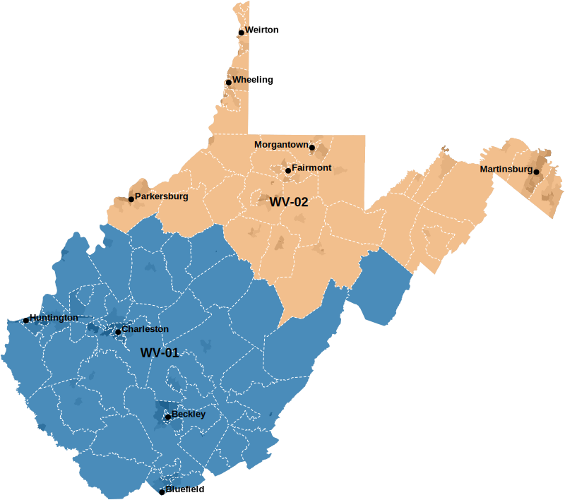

```{r}
source("https://raw.githubusercontent.com/jcervas/R-Functions/main/censusAPI/censusAPI.R")
blocks <- censusAPI(state="WV", geo="block", table="P1")
columns_to_remove <- grep("A$", colnames(blocks))
data_filtered <- blocks[, -columns_to_remove]
data_filtered$GEOID20 <- gsub("1000000US", "", data_filtered$GEO_ID)
data_filtered$blkgrp <- substr(data_filtered$GEOID20, 1, 12)
write.csv(data_filtered, "/Users/cervas/My Drive/GitHub/createMaps/WV/blockscsv.csv")
```

cd '/Users/cervas/My Drive/GitHub/createMaps/WV'

```
mapshaper \
-i '/Users/cervas/My Drive/GitHub/Data Files/GIS/Tigerline/TIGER2020PL/blocks/WV/tl_2020_54_tabblock20.json' name=blocks \
-i '/Users/cervas/My Drive/GitHub/createMaps/WV/blockscsv.csv' name=blockscsv string-fields=GEOID20 \
-i '/Users/cervas/My Drive/GitHub/createMaps/WV/cities.json' name=cities \
-simplify target=blocks 0.05 \
-join target=blocks source=blockscsv keys=GEOID20,GEOID20 \
-filter target=blocks 'AWATER20>=ALAND20' + name=water \
-dissolve \
-style target=water fill=#fff \
-dissolve target=blocks field=TRACTCE20 calc=' TOTAL = sum(P1_001N), COUNTYFP20 = max(COUNTYFP20), ALAND20 = sum(ALAND20), STATEFP20 = max(STATEFP20)' + name=tracts \
-dissolve target=blocks field=blkgrp calc=' TOTAL = sum(P1_001N), COUNTYFP20 = max(COUNTYFP20), ALAND20 = sum(ALAND20), STATEFP20 = max(STATEFP20)' + name=blkgrps \
-each target=blocks 'density = P1_001N / (ALAND20/2589988)' \
-each target=blkgrps 'density = TOTAL / (ALAND20/2589988)' \
-each target=tracts 'density = TOTAL / (ALAND20/2589988)' \
-dissolve target=tracts COUNTYFP20 + name=county \
-innerlines \
-style target=county fill=none stroke=#fff stroke-width=1 stroke-dasharray="0 3 0" \
```

```
-filter target=blocks 'STATEFP20 == "54"' + name=blocks-styled \
-filter target=blocks 'STATEFP20 == "54"' + name=blocks-bw \
-filter target=tracts 'STATEFP20 == "54"' + name=blkgrps-styled \
-filter target=tracts 'STATEFP20 == "54"' + name=tracts-styled \
-classify target=blocks-styled field=density save-as=fill colors=OrRd classes=9 key-name="legend_densityWV_blocks" key-style="simple" key-tile-height=10 key-width=320 key-font-size=10 key-last-suffix="" \
-classify target=blocks-bw field=density save-as=fill colors=greys classes=5 key-name="legend_densityWV_blocks" key-style="simple" key-tile-height=10 key-width=320 key-font-size=10 key-last-suffix="" \
-classify target=blkgrps-styled field=density save-as=fill colors=greys classes=9 key-name="legend_densityWV_blkgrps" key-style="simple" key-tile-height=10 key-width=320 key-font-size=10 key-last-suffix="" \
-classify target=tracts-styled field=density save-as=fill nice colors=greys classes=5 key-name="legend_densityWV_tracts" key-style="simple" key-tile-height=10 key-width=320 key-font-size=10 key-last-suffix="" \
-dissolve target=blocks-styled field=fill \
-dissolve target=blocks-bw field=fill \
-dissolve target=blkgrps-styled field=fill \
-dissolve target=tracts-styled field=fill \
-proj target=tracts-styled,blocks-bw,blkgrps-styled,blocks-styled,water,county,cities '+proj=lcc +lat_1=39 +lat_2=40.25 +lat_0=38.5 +lon_0=-79.5 +x_0=600000 +y_0=0 +ellps=GRS80 +units=m +no_defs' \
-o target=blocks-styled,water,county,cities '/Users/cervas/My Drive/GitHub/createMaps/WV/images/WV_blocks.svg' format=svg \
-o target=blocks-bw,water '/Users/cervas/My Drive/GitHub/createMaps/WV/images/WV_blocks_bw.svg' format=svg \
-o target=blkgrps-styled,water,county,cities '/Users/cervas/My Drive/GitHub/createMaps/WV/images/WV_blkgrps.svg' format=svg \
-o target=tracts-styled,water,county,cities '/Users/cervas/My Drive/GitHub/createMaps/WV/images/WV_tracts.svg' format=svg \

```

```
-i '/Users/cervas/My Drive/GitHub/Data Files/GIS/Congress/US_2022_Districts.json' name=cd2022 \
-proj target=cd2022 '+proj=lcc +lat_1=39 +lat_2=40.25 +lat_0=38.5 +lon_0=-79.5 +x_0=600000 +y_0=0 +ellps=GRS80 +units=m +no_defs' \
-filter 'ST=="WV"' \
-info \
-style target=cd2022 stroke-width=1 fill=none stroke-opacity=1 stroke=#000 \
-each target=cd2022 'cx=this.innerX, cy=this.innerY' \
-points target=cd2022 x=cx y=cy + name=cd2022-labels \
-style target=cd2022-labels label-text=CODE text-anchor=middle fill=#000 stroke=none opacity=1 font-size=18px font-weight=800 line-height=20px font-family=arial class="g-text-shadow p" \
-classify target=cd2022 save-as=fill colors=Category20 non-adjacent \
-style target=cd2022 opacity=0.75 stroke=none \
-o target=tracts,cd2022,county,cities,us-cart,cd2022-labels '/Users/cervas/My Drive/GitHub/createMaps/WV/images/cd2022.svg' \
```


-filter target=us-cart 'STATEFP == "35"' \
-style target=us-cart fill=none stroke=#000 opacity=1 stroke-opacity=1 \

mapshaper -i '/Users/cervas/My Drive/GitHub/createMaps/NM/USA_Major_Cities.geojson' name=cities \
-filter target=cities "ST=='WV'" \
-filter target=cities "POP_CLASS>=6" \
-filter target=cities '["St. Albans","South Charleston","Teays Valley","Vienna"].indexOf(NAME) > -1' invert \
-filter target=cities "POP_CLASS>=6" + name=cities-labels \
-filter-fields target=cities,cities-labels NAME \
-style target=cities-labels label-text=NAME text-anchor=start font-size=13px font-weight=800 line-height=16px font-family=arial class="g-text-shadow p" \
-each target=cities-labels dx=5 \
-each target=cities-labels dy=0 \
-style target=cities-labels 'text-anchor=end' where='["Martinsburg","Morgantown"].indexOf(NAME) > -1' \
-style target=cities-labels 'dx=-5' where='["Martinsburg","Morgantown"].indexOf(NAME) > -1' \
-style target=cities r=4 \
-each target=cities "type='point'" \
-each target=cities-labels "type='text-label'" \
-merge-layers target=cities,cities-labels force \
-o target=cities,cities-labels '/Users/cervas/My Drive/GitHub/createMaps/WV/cities.json' format=geojson
