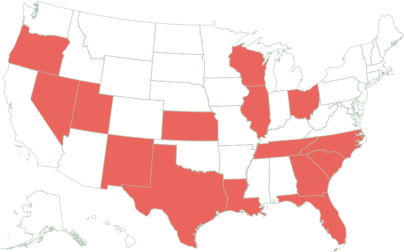

<!--
# Documentation for Gerrymander Map Generation Workflow

This script provides a step-by-step workflow for generating SVG maps that visualize the worst gerrymandered states for 2025 using Mapshaper. The process involves:

1. **Setting the Working Directory**: Ensures all file paths are relative to the project folder.
2. **Loading Data**: Imports county boundaries (`counties-albers-med.json`) and gerrymander data (`gerrymanders.csv`).
3. **Joining Data**: Merges state geometries with gerrymander data using state abbreviations as keys.
4. **Styling Layers**: Applies visual styles to state lines and fills for clear map distinction.
5. **Exporting Output**: Outputs the final styled map as an SVG file for visualization.

The resulting SVG (`images/gerrymanders.svg`) can be embedded in documentation or reports to illustrate the identified gerrymandered states.

-->
# Create Worst Gerrymanders (2025) for PGP

Change to the project directory:
```sh
cd '/Users/cervas/Library/CloudStorage/GoogleDrive-jcervas@andrew.cmu.edu/My Drive/GitHub/createMaps/gerrymanders'
```

Run Mapshaper to generate the map:

```sh
# Load county boundaries and gerrymander data
mapshaper \
    -i 'counties-albers-med.json' \                # Load county boundaries
    -i 'gerrymanders.csv' \                        # Load CSV with gerrymander data (sourced from gerrymander.princeton.edu)
    -join target=states source=gerrymanders.csv \  # Join gerrymander data to state geometries
        keys='ST,abv'                                # Match on state abbreviation
```

```sh
# Style the map layers
-style target=statelines fill=none stroke='#b0c4b1' stroke-width=1 stroke-dasharray="0 3 0" \  # Style state lines
-style target=states fill=color stroke=#b0c4b1 stroke-width=1                                 # Style state fills
```

```sh
# Export the styled map as an SVG file
-o target=statelines,states 'images/gerrymanders.svg'
```

## 2025 Worst Gerrymandered States

    
**Sources:** Map adapted from The New York Times; data from Princeton Gerrymandering Project Report Cards.
