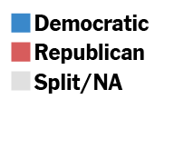
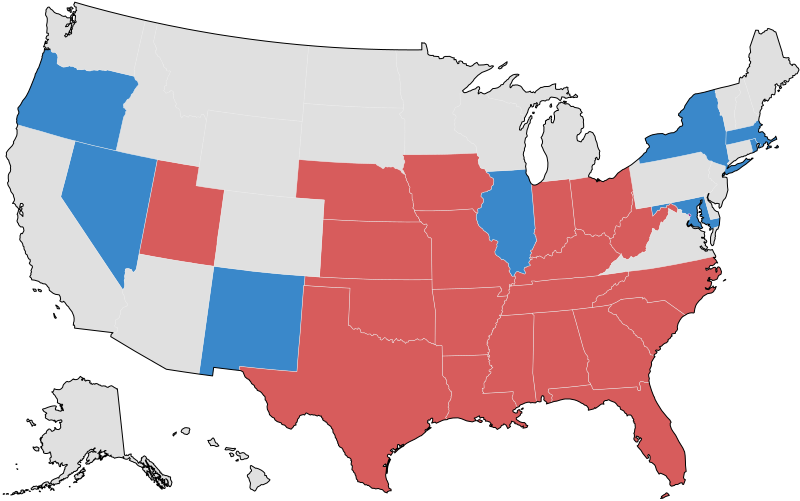
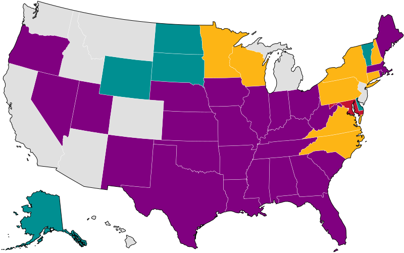

## Party Control of the 2020 Congressional Redistricting

  
  

## Who Drew the Maps for use in 2020?

  

  


```{shell}
cd '/Users/cervas/Library/CloudStorage/GoogleDrive-jcervas@andrew.cmu.edu/My Drive/Academic/Published-Papers/ALR-Partisan-Gerrymandering-Cases/maps'
mapshaper \
-i 'us-cart.json' \
-simplify us-cart 2% \
-i 'map-data.csv' \
-join target=us-cart source=map-data keys=STUSPS,State \
-proj target=us-cart albersusa \
-classify target=us-cart field=party-contol colors='#E0E0E0','#3A88CA',purple,'#D75C5C','#E0E0E0' null-value="#000" key-name="legend-party-control" key-style="simple" key-tile-height=10 key-width=320 key-font-size=10 \
-innerlines target=us-cart target=us-cart + name=lines \
-style target=lines stroke='#E9E9E9' stroke-width=0.5 \
-dissolve target=us-cart + name=US \
-style target=US stroke=#000 fill=none \
-o target=us-cart,lines,US 'party-control.svg' \
-classify target=us-cart field=drew-lines colors='#008F91','#C41230','#E0E0E0',purple,'#FDB515','#E0E0E0' null-value="#000" key-name="legend-drew-lines" key-style="simple" key-tile-height=10 key-width=320 key-font-size=10 \
-o target=us-cart,lines,US 'drew-lines.svg'
```
